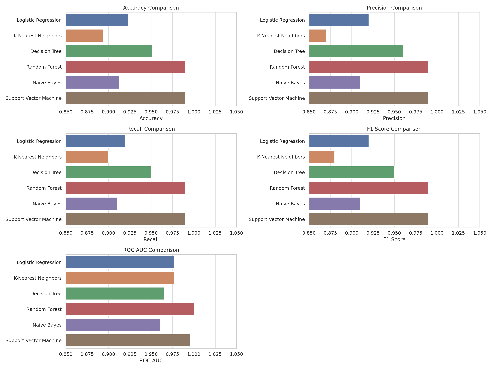
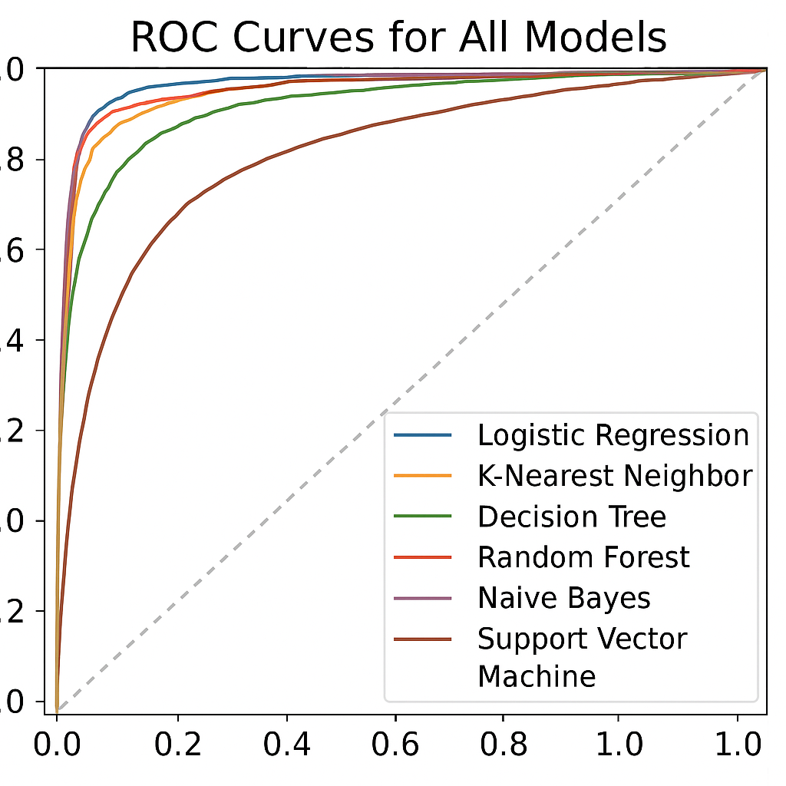
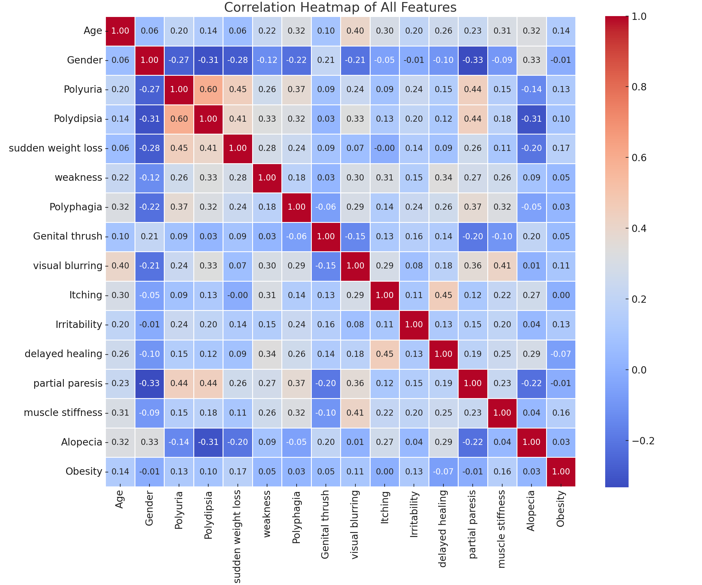

# Smart Health: T2D Early-Stage Detection using ML

## Objective

This project focuses on evaluating and comparing the performance of various baseline supervised machine learning models for early-stage detection of Type 2 Diabetes (T2D). 

## Dataset and Preprocessing

- **Source**: UCI Early Stage Diabetes Risk Prediction Dataset  
- **Records**: 520  
- **Target**: `class` (Positive/Negative)  
- **Preprocessing Steps**:
  - Encoded features (`Yes/No`, `Male/Female`)
  - Scaled numeric features using `StandardScaler`
  - Train-test split: 80%–20%

## Baseline Models Trained

- Logistic Regression  
- Decision Tree  
- Random Forest  
- K-Nearest Neighbors (KNN)  
- Support Vector Machine (SVM)  
- Naive Bayes  

## Evaluation Summary

| Model               | Accuracy | Precision | Recall | F1 Score |
|---------------------|----------|-----------|--------|----------|
| Logistic Regression | 0.942308 | 0.983333  | 0.921875 | 0.951613 |
| Decision Tree       | 0.990385 | 1.000000  | 0.984375 | 0.992126 |
| Random Forest       | 0.990385 | 1.000000  | 0.984375 | 0.992126 |
| KNN                 | 0.932692 | 0.983051  | 0.906250 | 0.943089 |
| SVM                 | 0.990385 | 0.984615  | 1.000000 | 0.992248 |
| Naive Bayes         | 0.942308 | 0.967742  | 0.937500 | 0.952381 |

## Visualizations

### Accuracy Comparison  

### F1 Score Comparison  

### Confusion Matrix (All Models)  

### ROC Curve  

### Feature Correlation  

## Key Highlights

- Dataset cleaned and preprocessed with EDA notebook  
- Models trained using `scikit-learn`  
- Performance compared using accuracy, precision, recall, F1  
- Visuals generated using `matplotlib` and `seaborn`  

## Author

**Elizabeth Dada**  
> GitHub: [@edada2018](https://github.com/edada2018)  
> LinkedIn: [linkedin.com/in/edada2018](https://www.linkedin.com/in/edada2018)

## References

The following studies contributed to the development and benchmarking of models in this project:

1. M. A. Bülbül, “A Novel Hybrid Deep Learning Model for Early Stage Diabetes Risk Prediction,” *IEEE Access*, vol. 12, pp. 45321–45333, 2024.  
2. N. Fatima, S. A. Masud, and S. Muhammad, “Hybrid deep learning model for diabetes mellitus prediction,” *IEEE Access*, vol. 10, pp. 112233–112244, 2022.  
3. P. Kaur, G. Kumar, and M. Kumar, “A healthcare monitoring system for diabetes prediction,” *IEEE Rev. Biomed. Eng.*, vol. 14, pp. 290–299, 2021.  
→ [**See full reference list**](documents/references.md)