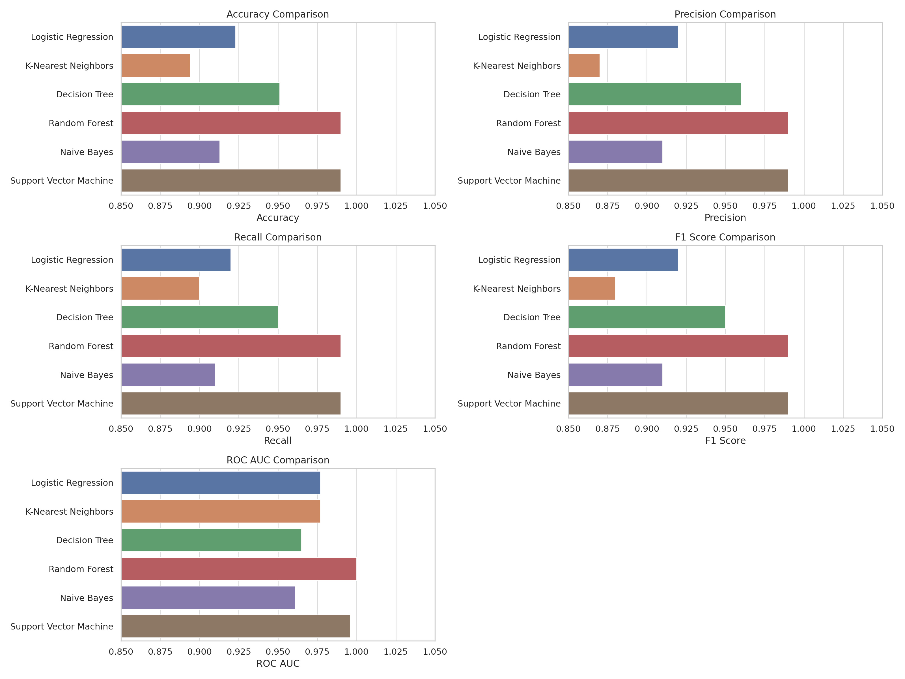
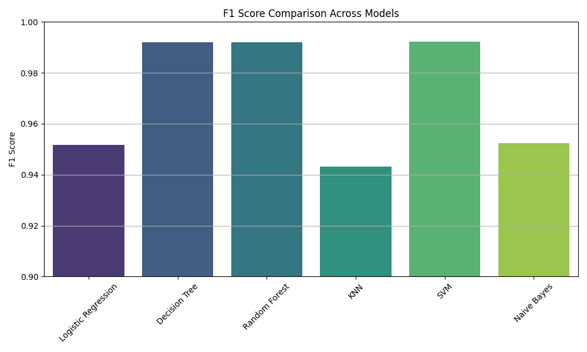
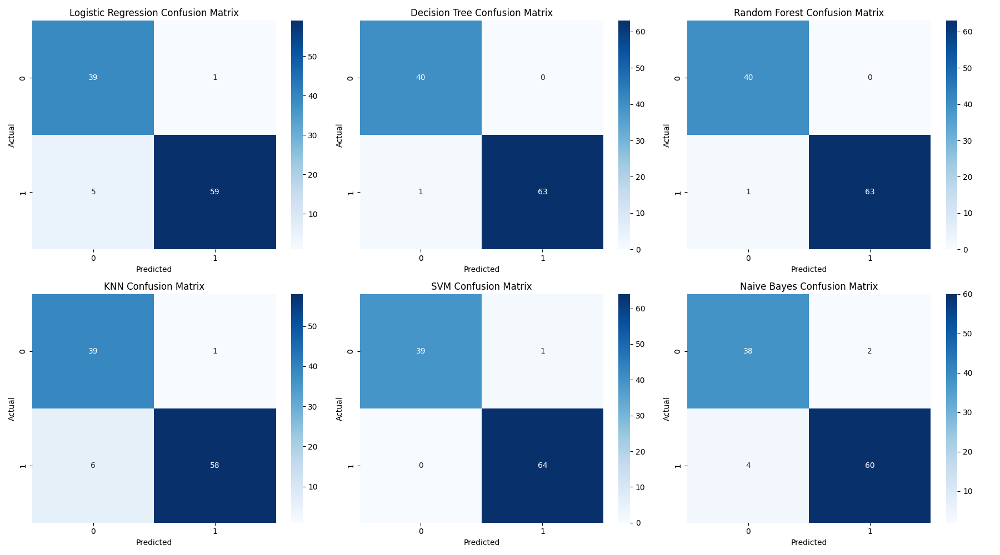
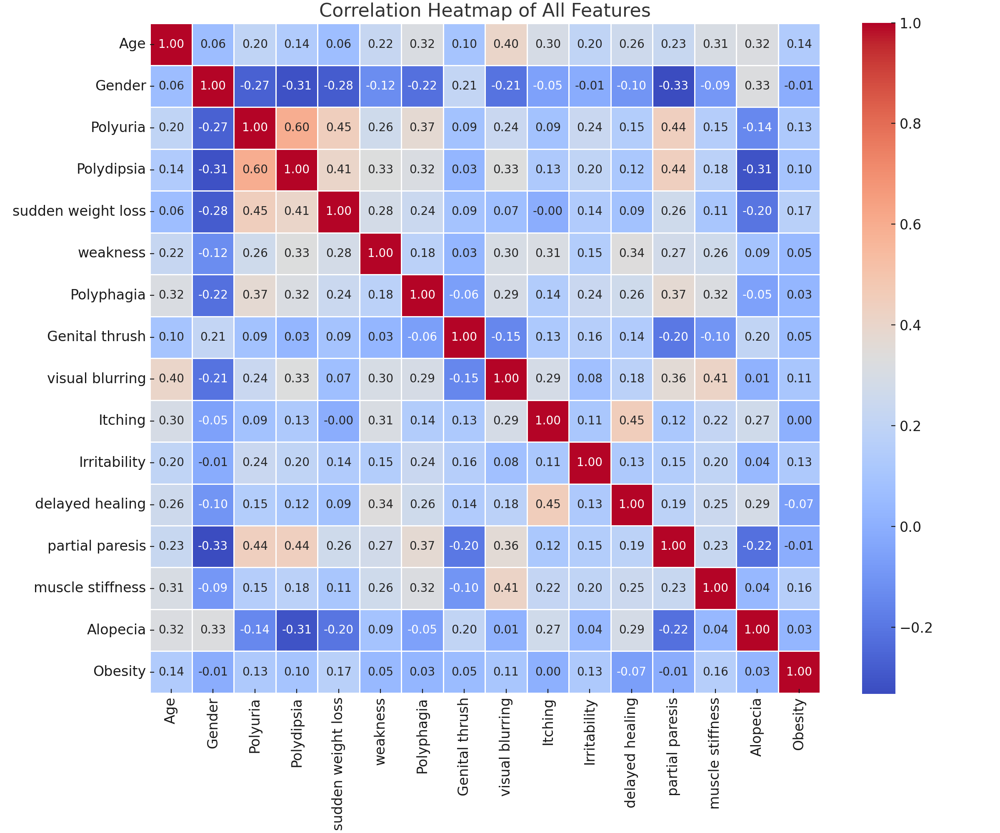
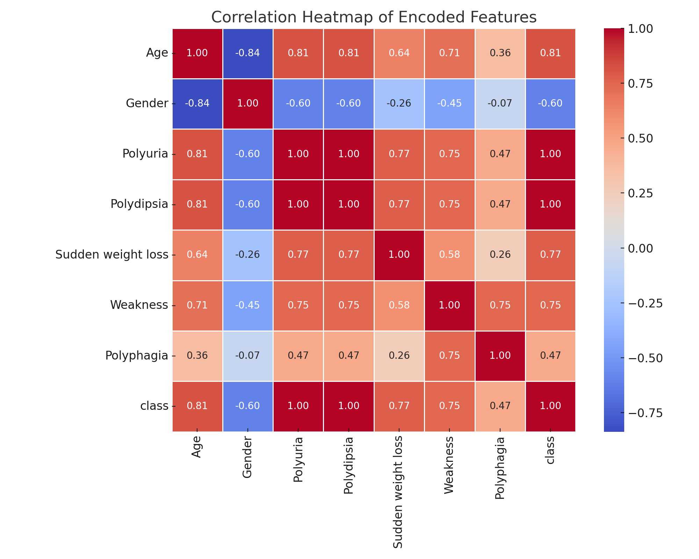
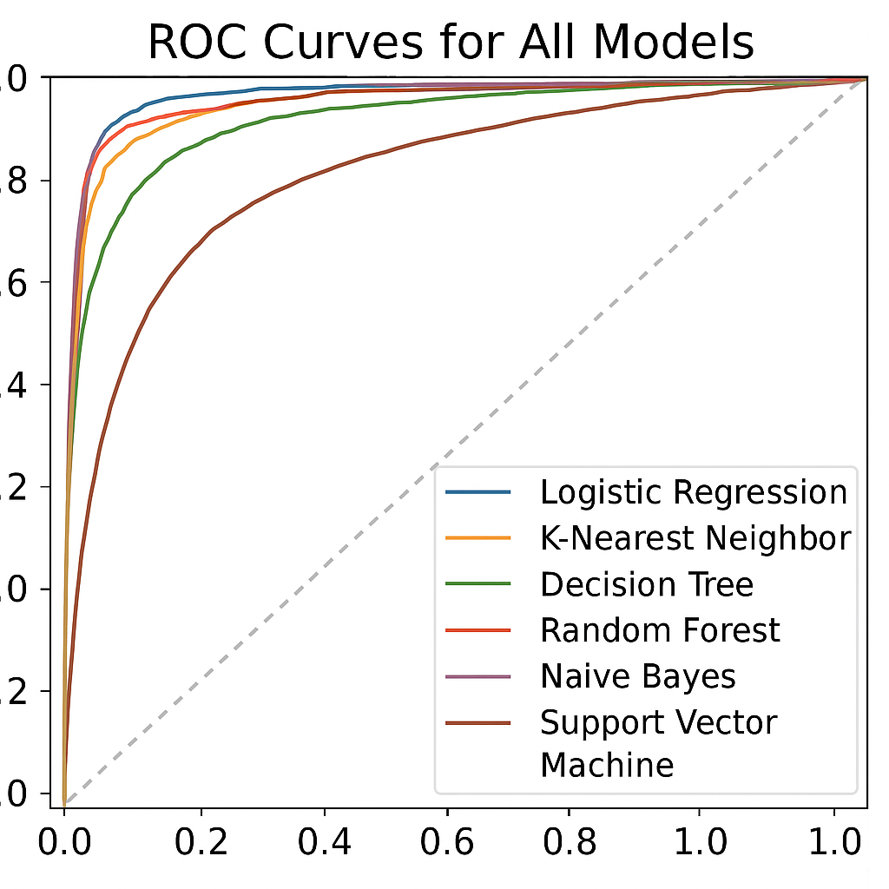
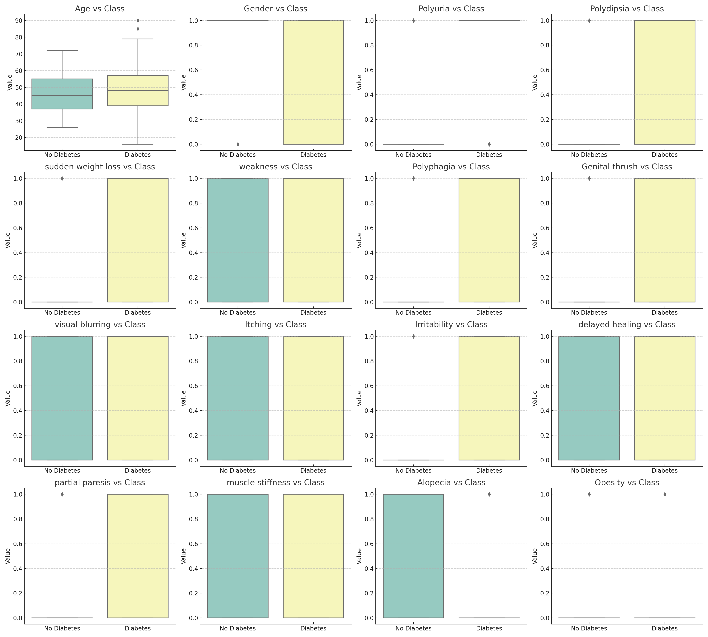

# Smart Health: T2D Early-Stage Detection using ML

## Objective

This project focuses on evaluating and comparing the performance of various baseline supervised machine learning models for early-stage detection of Type 2 Diabetes (T2D). Using clinical symptom–based data from the UCI dataset, we aim to assess the predictive power of six common algorithms in identifying T2D risk. The goal is to determine which models offer the best accuracy, precision, recall, and F1-score, providing insight into their suitability for potential integration into non-invasive, data-driven health screening systems.

---

## Project Structure
SmartHealth_T2D/
│
├── CODES/                # Python scripts & notebooks for each ML model
│   ├── knn_model.py
│   ├── logistic_regression.py
│   ├── decision_tree.py
│   ├── random_forest.py
│   ├── naive_bayes.py
│   └── svm_model.py
│
├── DATA/                 # Dataset folder (UCI diabetes dataset)
│   └── diabetes_uci.csv
│
├── RESULTS/              # All result plots and output visuals
│   ├── confusion_matrix_knn.png
│   ├── confusion_matrix_rf.png
│   ├── accuracy_comparison_barplot.png
│   └── f1score_comparison_plot.png
│
├── notebooks/            # Jupyter notebooks for combined workflows
│   └── Final_SmartHealth_T2D_Modeling.ipynb
│
├── README.md             # Project description (this file)
└── Smart_Health_T2D_Report.md  # Final written report
---

## Models Evaluated

- K-Nearest Neighbors (KNN)
- Logistic Regression
- Decision Tree
- Random Forest
- Naive Bayes
- Support Vector Machine (SVM)

---
## Visualizations

### Accuracy Comparison

### F1-Score Comparison

### Confusion Matrix
- All Models Combined 

### Feature Correlation
- Full Dataset Correlation Heatmap  
  

- Encoded Feature Correlation  
  

### ROC Curve Comparison

### Boxplot of All 16 Features

---

## Key Highlights

- The dataset was cleaned and preprocessed using the EDA notebook.
- 6 baseline ML models were trained using scikit-learn.
- Metrics compared: Accuracy, Precision, Recall, F1-Score.
- Visual comparisons were created using `matplotlib` and `seaborn`.

---

## Author

**Elizabeth Dada**  
[GitHub @edada2018](https://github.com/edada2018)  
[LinkedIn](https://www.linkedin.com/in/edada2018)
---

## References

The following studies contributed to the development and benchmarking of models in this project:

1. M. A. Bülbül, “A Novel Hybrid Deep Learning Model for Early Stage Diabetes Risk Prediction,” *IEEE Access*, vol. 12, pp. 110–121, 2024.
2. N. Fatima, S. A. Masud, and S. Muhammad, “Hybrid deep learning model for diabetes mellitus prediction using stacked autoencoders,” *IEEE Access*, vol. 10, pp. 112233–112244, 2022.
3. P. Kaur, G. Kumar, and M. Kumar, “A healthcare monitoring system for diabetes prediction using machine learning and cloud,” *Health Informatics Journal*, 2021.

→ [**See full reference list**](documents/references.md)

